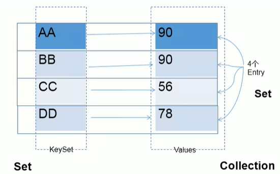
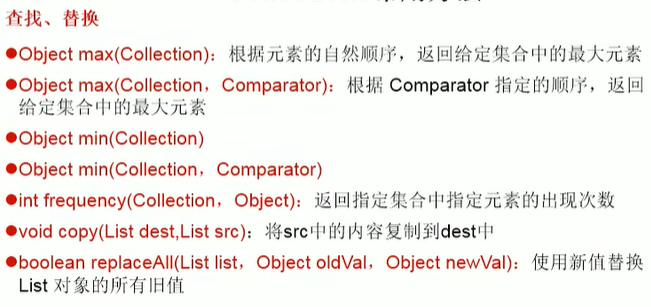
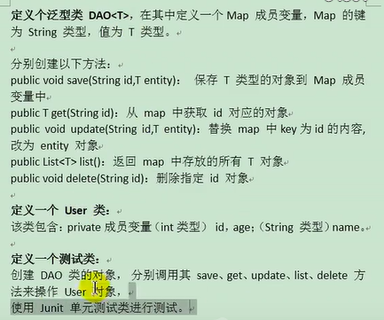

java语言概述、基本语法、数组

#### 4、面向对象（上）

java变量类型：基本数据类型：

数值型：byte short long float double 字符型：char 布尔型:   boolean

引用数据类型： 类class  包含字符串 接口interface  数组([])

##### 4.1 面对对象三大主线

1.Java类及类的成员

2.面对对象的三大特征：封装 继承 多态 

3.其他关键字this super static final abstract interface package import

面对对象和面向过程：

面对过程：强调功能行为，以函数为最小单位，强调怎么做

面对对象：将功能封装进对象，强调具备了功能的对象，以类/对象为最小单位，考虑谁来做。

##### 4.2 类和对象

类的成员包括属性和方法

属性：成员变量

方法：成员函数

##### 4.3 对象的创建与使用：内存解析

堆区：存放对象实例 new

虚拟机栈：局部变量 形参

方法区：常量、静态常量、编译后的代码

类中成员变量和局部变量的区分：成员变量在class {}内，可以使用权限修饰符；局部变量在方法内，或者是形参，或者构造器内 构造器形参

##### 4.4 匿名对象

new class名().方法()；  .属性

只能调用一次，开发中将匿名对象用作函数的形参

##### 4.5 重载

同一个类 相同方法名 

参数列表不同 参数个数不同 参数类型不同

与权限修饰符 返回值类型 形参变量名 方法体无关

##### 4.6 值传递

值传递机制：

如果是基本数据类型，此时赋值的是变量所保存的数据值；如果是引用数据类型（null或地址值），此时赋值的是变量所保存的数据的地址值，比如new的对象

##### 4.7 封装和隐藏

创建一个类的对象之后，用对象.属性的方式进行赋值，此时只有数据类型和存储范围的限制。但是实际问题中属性赋值时有限制条件，这个不能在属性声明时体现，就需要用方法进行限制。（比如年龄不能为负值）

要避免用对象.属性的方式进行赋值，将属性声明为私有，用公共的方法来获取和设置属性的值。此时就体现了封装性。

四种权限修饰符

private 缺省 protected public

public可以任意访问 default只能在同一个包内部的类访问


 修饰类只能用缺省和public

出了类，private的属性就不能被访问；出了包，缺省不能访问；

总结封装性：java提供四种权限修饰修饰类及类的内部结构，体现类及类的内部结构在被调用时的可见性。

##### 4.8 类的成员之三：构造器

构造器的作用：

1.创建对象  new+构造器   new Person()

2.给对象初始化，初始化对象的信息

如果没有显式定义构造器，系统默认提供一个空的构造器；

定义构造器的格式：权限修饰符 类名（形参列表）{}

一个类中多个构造器构成重载；一旦定义了构造器，就不再提供默认构造；一个类至少需要一个构造器。

拓展：JavaBean的三个条件：1、类是公共的 2、有一个无参的公共的构造器 3、有属性、且有对应的get、set方法。

 UML类图：根据图写出类

##### 4.9 this的使用

一般情况省略this；特殊情况当类的属性和方法的形参同名，用this.属性表示是该类的属性，而非形参

构造器内调用另一个构造器 this(形参)，不能调用自己，或者避免调用成环，陷入循环。

#### 5、面向对象（中）

##### 5.1 继承

class A extends B

A:subclass     B:superclass

优点：1.减少代码荣誉，提高复用性  2. 便于动态扩展  3. 为之后多态的使用提供前提。

体现：父类中private的属性或方法，子类仍然获取了父类私有的结构，只是因为封装性的影响，使得子类不能直接调用父类的结构。

java中的继承性：如果没有显式的声明一个类的父类，则此类继承于java.lang.Object类。所有类都直接或间接地继承于此类。

##### 5.2 方法的重写

子类对父类继承的方法进行改造，对父类同名同参数的方法进行覆盖。

应用：重写之后，当创建子类对象以后，通过子类对象调用父类中同名同参数的方法时，实际执行的是子类重写父类的方法。

##### 5.3 方法重写的细节 

子类重写方法的权限修饰符不小于父类被重写的方法的权限修饰符，子类不能重写父类中private权限的方法

子类重写的方法抛出的异常不大于父类被重写的方法抛出的异常类型

重写时父类和子类要么都声明为static，要么都声明为非static

父类被重写的方法返回类型是A类，子类重写的方法的返回类型必须是A或者A的子类

##### 5.4 关键字super

super关键字：可以理解为父类的

super可以用来调用：属性、方法、构造器

一般情况下省略super。当子类父类中出现了同名的属性，在子类中使用 super.属性 显式地调用父类的属性

this(形参列表)：调用本类重载的构造器

super调用构造器： super(参数1，参数2)；

1、可以在子类的构造器中显式的使用上述方式调用父类中声明的指定构造器。

2、super必须声明在子类构造器的首行

3、在类的构造器中，this(形参列表)或super(形参列表)只能二选1

4、在子类构造器的首行没有显式的声明的时候默认调用super();

##### 5.5 子类对象实例化的过程

从结果上看：子类继承父类，就获取了父类中声明的属性或方法。创建子类的对象，在堆空间中，就会加载父类中声明的属性。

从过程上看，当通过子类的构造器创建子类对象时，一定会直接或间接地调用父类的构造器，父类的父类的...直到java.lang.Object类中的空参构造器。


##### 5.6 多态性

- 理解：一个事物的多种形态

```java
class Person() {}
class Man extends Person {}
main(){
    //对象的多态性：父类的引用指向子类的对象
    Person p = new Man();
}
```

- 多态的使用：

  当调用子父类同名同参数的方法时，实际执行的是子类重写父类的方法-------虚拟方法调用

编译期只能调用父类声明的方法，在运行期，实际执行的是子类重写父类的方法。编译看左边，运行看右边

- 多态的使用前提：继承 方法的重写

多态使用实例：

```java
class AnimalTest(){
    main(){
        AnimalTest test = new AnimalTest();
        test.func(new Dog());
        //此时运行的是Dog的函数
    } 
    //没有多态性就不能调用子类重写的方法，就需要进行方法的重载
    func(Animal animal){ //Animal animal = new Dog()
        animal.eat();
        animal.shout();
    }
}
class Animal(){
    eat(){};
    shout(){};
}
class Dog extends Animal{
    eat(){};
    shout(){};
}
class Cat extends Animal{
    eat(){};
    shout(){};
}
```

多态不适用于属性，只适用于方法

- 动态绑定：多态是编译时行为还是运行时行为？运行时行为，运行时才知道new的对象是什么

编译时为Animal类型，而方法的调用是在运行时确定的，所以调用的是new子类中的方法。

- 方法的重载和重写：

从编译和运行角度：重载：方法调用之前，编译器就确定了要使用的方法。早绑定或静态绑定

多态：方法调用的那一刻，编译器才确定要调用的方法。晚绑定或动态绑定

- 补充：instanceof操作符

x instanceof A：检验x是否为类A的对象，返回值为boolean

要求x所属的类与类A必须是子类和父类的关系，否则编译错误；如果x属于类A的子类B，x instanceof A也为true

有了对象的多态性，内存中实际上是加载了子类特有的属性和方法，但是由于声明为父类类型，导致，编译时，只能调用父类中声明的属性和方法。 如何才能调用子类特有的属性和方法？向下转型：使用强制类型转换符。

为了避免使用强制转换时出现异常，一般先用x instanceof A进行判断。

  向上转型：多态    

Person p = new Man();       Man m = Man(p);

##### 5.7 Object类的使用

- Object类是所有Java类的根父类

- ==运算符：

1、基本数据类型变量，比较两个变量值是否相等（不一定类型相同）。

2、引用数据类型变量，比较两个对象的地址是否相同，即两个引用是否指向同一个对象实体。

3、符号使用时，必须保证符号两边的变量类型一致。

- equals()方法的使用：

1、只能适用于引用数据类型

2、Object类中equals()的定义和==作用是相同的。

3、像String Date File 包装类都重写了Object类中的equals()方法。重写以后，比较的不是两个引用的地址， 而是比较两个对象的实体内容是否相同。

4、通常情况下我们自定义的类要使用equals()的话，也是通常比较两个对象的实体内容是否相同， 就需要对Object类中的equals()进行重写。

5、重写前比较引用类型的地址，重写后比较内容

总结：比较基本数据类型用==，比较引用数据类型用equals()

- toString()方法

Object类中toString()的使用：

1、当输出一个对象的引用时，实际上就是调用当前对象的toString()

2、Object类中toString()的定义就是输出地址（虚拟地址）

3、String、Date、File、包装类都重写过toString()方法，使得在调用对象的toString()时2，返回实体内容信息。

4、自定义类也可以重写toString() 方法。

##### 5.8 包装类的使用

封装类 


 包装类的使用：

1、Java提供了8中数据类型对应的包装类，使得基本数据类型的变量具有类的特征

2、  **重点**：基本类型、包装类与String类三者间的转换


```java
//基本数据类型---->包装类：调用包装类的构造器
int num1 =10;
Integer in1 = new Integer(num1);
//包装类----->基本数据类型：调用包装类的xxxValue()
Integer in1 = new Integer(12);
int i1 = i1.intalue();
//JDK5.0新特性：自动装箱与拆箱
//自动装箱
int num2 = 10;
Integer in2 = num2;直接转为包装类
//自动拆箱
int num3 = in1;包装类直接转为基本类型
```

```java
//基本数据类型、包装类--->String类型
//方式一 ：
int num1 = 10;
String str1 = num1 + "";
//方式二：使用String重载的Valueof(xxx)
float f1 = 3.2f;
String s1 = String.valueOf(f1);
//String类---->基本数据类型、包装类
//错误示例：
String srt1 = "123";
int num1 = int(str1);
Integer in1 = (Integer)str1;不能强转，没有子父类关系。
//调用包装类的parsexxx()方法
Integer.parseInt(str1);
```

重点：自动拆箱装箱 valueOf()   parsexxx()方法

#### 6、面向对象（下）

##### 6.1 关键字static

编写类时，其实就是描述其对象的属性和行为，而并没有产生实质的对象，只有new关键字才会产生出对象，这时系统才会分配内存给对象，其方法才能供外部调用。

有时希望无论是否产生对象，某些特定的数据在内存空间里只有一份，例如每个中国人都有统一的国家，不必在每个人的实例对象中都单独分配一个用于代表国家的变量。

1、static:静态的

2、static可以用来修饰：属性、方法、代码块、内部类

3、使用static修饰属性：静态变量（类变量）

​	3.1、属性按照是否用static修饰分为 静态属性 VS非静态属性（实例变量）

​	实例变量：创建类的多个对象，每个对象都有一套类中的非静态属性，当修改某个对象的非静态属性时，不会影响其他对象的属性值。

​	静态变量：创建类的多个对象，每个对象都共享同一个静态变量。修改某个对象的静态变量，其他对象调用时是修改过的。

​	3.2、static修饰属性的其他说明：

​	静态变量随着类的加载而加载

​	静态变量的加载要早于对象的创建

​	由于类只会加载一次，则静态变量在内存中也只会存在一份，存在方法区的静态域中。

​	是否调用		类变量     		实例变量

​	类						√						×

​	对象					√						√

​	3.3、静态常量举例：System.out；Math.PI；


4、使用static修饰方法：

随着类的加载而加载，通过类.静态方法的方式进行调用，无需创建对象
    是否调用		静态方法     	非静态方法
 	类			             √		      		×
 	对象	  		       √			     	√
	 静态方法中只能调用静态的方法和属性；非静态方法中既可以调用非静态方法属性，也可以调用静态方法属性。

5、static注意点：

	> 5.1、在静态的方法内，不能使用this关键字、super关键字
	>因为静态是基于类的，还没有对象；this和super都是基于对象
	> 5.2、关于静态属性和静态方法的使用，都从生命周期的角度去理解。

6、开发中，如何确定一个属性是否声明为static？

	> 属性可以被多个对象共享，不会随着对象的不同而不同。

​	   开发中，如何确定一个方法是否声明为static？

​	操作静态属性的方法，通常设置为static

​	工具类中的方法，习惯上声明为static。比如Math类、Arrays

设计模式：在大量的时间中总结和理论化之后优选的代码风格、编程风格以及解决问题的思考方式。套路


单例设计模式：采取一定方式保证在整个软件系统中，对某个类只能存在一个对象实例，并且该类只提供一个取得其对象实例的方法。

如何实现？

```java
//1、饿汉式实现:一开始就造好
///不让用户去自主的创建实例对象，而是自己创建好实例对象，让用户通过设置好的方法去调用
class Bank() {
	//1、私有化类的构造器
	private Bank(){}
    //2、内部创建类的对象
    private static Bank instance = new Bank();
    //3、提供公共静态方法返回类的对象
    //要求只能通过类调用＋static
    public static Bank getInstace(){
        return instance;
    }
    //4、要求此对象也必须声明为static
}
//2、懒汉式实现:什么时候用什么时候造
class Order(){
    //1、私有化类的构造器
    private Order(){      
    }
    //2、声明当前类的对象，没有初始化
    private static Order instance = null;
    //3、声明public的static的返回当前类对象的方法
    public Order getInstance(){
        if(instance == null) {
         	instance = new Order();   
        }
        return instance;
    }
    //4、此对象必须为static
}
```

3、区分饿汉式和懒汉式
饿汉式：坏处：导致对象加载时间过长
	           好处：饿汉式是线程安全的,只有一份，谁取谁用
懒汉式：好处：延迟对象的创建
		       坏处：线程不安全。阻塞时可能会导致多个对象创建

##### 6.2 理解main方法的语法

 程序的入口 为什么加static？ 

因为可以通过类调用，不用通过对象调用。[static](https://so.csdn.net/so/search?q=static&spm=1001.2101.3001.7020)是静态的，系统类刚加载的时候不能创建对象，没办法用对象调用。

同时，对象调用的话，这个类要有构造，构造又可以被重载。如果重载了之后，会有多个main方法，则main方法不能作为唯一入口

##### 6.3 类的成员之四：代码块

 代码块（初始化块）  表示：{}

1、代码块的作用：用来初始化类，对象

2、代码块如果有修饰的话，只能使用static

3、分类：静态代码块 VS 非静态代码块

静态代码块：static{}

​		内部可以有输出语句

​		随着类的加载而执行

作用：初始化类的信息

​		静态代码块的执行要优先于非静态代码块的执行

非静态代码块：

​		内部可以有输出语句

​		随着对象的创建而执行，每创建一个对象就执行一次非静态代码块 

​		作用：可以在创建对象时 对 对象的属性初始化

执行顺序原则：由父及子，静态先行

没创建对象时先执行静态代码块，顺序都是由父及子。

对属性可以赋值的位置：

①默认初始化

②显式初始化/⑤在代码块中赋值

③构造器中初始化

④有对象之后，通过对象.属性的方式进行赋值

执行的先后顺序：① - ②/⑤ - ③ - ④

##### 6.4 关键字：final 

1、final可以修饰的结构：类、方法、变量

2、final修饰类，此类不能被其他类继承，是最后一代

final class A{

}

3、final修饰方法表明此方法不能被重写

4、final修饰变量，此时的变量就是一个常量

​	4.1、final修饰属性，可以考虑赋值的位置有显式初始化、代码块赋值，构造器中赋值。  

​	4.2、final修饰局部变量：修饰形参表示该形参是常量，赋值以后不能重新赋值。

5、static final 用来修饰属性：全局常量

​		修饰方法

##### 6.5 抽象类与抽象方法

将父类设计的非常抽象，以至于他没有具体的实例，这样的类叫做抽象类。

关键字abstract 使用前提：继承性

可以用来修饰：类、方法

1、抽象类：

​	不能实例化

​	一定有构造器，便于子类实例化时使用，

​	开发中都会提供抽象类的子类。让子类实例化

2、抽象方法：

​	只有方法的声明，没有方法体。

​	抽象类可以没有抽象方法，包含抽象方法的类一定是抽象类。

​	若子类重写了父类所有的抽象方法，则可以实例化；若没有，则子类也是抽象类。

3、抽象类的应用：当对象不清晰时，可以抽象处理并在子类中实例化

4、抽象类的匿名子类:

 Person p = new Person(){

​	重写的方法；

};

5、多态应用：模板方法设计模式

抽象类就是一种模板模式的设计，抽象类作为子类的通用模板，子类在抽象类的基础上进行扩展改造，但子类总体保留抽象类的行为模式。

6、抽象类应用：

```java
public abstract class Vehicle{
	public abstract double calcFuelfficiency(); //计算燃料效率的抽象方法
	public abstract double calc TripDistance(); //计算 行驶距离的抽象方法
}
public class Truck extends Vehicle{
	public double calcFuelEficiency() { //写出计算卡车的燃料效率的具体方法}
	public double calcTripDistance() { //写出计算卡车行驶距离的具体方法}
}
public class RiverBarge extends Vehicle{
	public double calcFuelfficiency( ){ /写出计算驳船的燃料效率的具体方法}
	public double calc TripDistance() { //写出计算驳船行驶距离的具体方法}
```

抽象类练习：

编写一个Employee类，声明为抽象类，包含如下三个属性: name, id, salary。

提供必要的构造器和抽象方法: work()。

对于Manager类来说，他既是员工，还具有奖金(bonus )的属性。

请使用继承的思想，设计CommonEmployee类和Manager类，要求类中提供必要的方法进行属性访问。

```java
//Employee类
public abstract class Employee {
    private String name;
    private int id;
    private double salary;
    public Employee() {
        super();
    }
    public Employee(String name, int id, double salary) {
        super();
        this.name = name;
        this.id = id;
        this.salary = salary;
    }
    public abstract void work() { };
}
//Manager类
public class Manager extends Employee {
    private double bonus;
    public Manager(double bonus) {
        super();
        this.bonus = bonus;
    }
    public Manager(String name, int id, double salary, double bonus) {
        super(name, id, salary);
        this.bonus = bonus;
    }
    //子类重写
    public void work() { 
    	System.out.println("管理员工");
    };
}
//CommonEmployee类
public class CommonEmployee extends Employee {
    public void work() { 
    	System.out.println("员工生产");
    };
}
public class Test{
    public static void main(String[] args) {
      //也可以用多态 Employee manager =
      Manager manager = new Manager("爆",01,5000,50000); 
      manager.work();
    }
    CommonEmployee cm = new CommonEmployee();
    cm.work();
}
```

##### 6.6 接口（interface）

利用接口实现多重继承（子类继承多个父类）

class AA extends BB implements CC,DD,EE;

1、关键字interface

2、java中接口和类是并列的两个结构

3、如何定义接口：定义接口中的成员

​	3.1、JDK7及以前：只能定义全局常量和抽象方法

​	>全局常量：public static final

​	>抽象方法：public abstract

​	3.2、JDK8：除了全局常量和抽象方法，还可以定义静态方法、默认方法

4、接口中不能定义构造器，意味着不能实例化

5、接口通过让类去实现（implements）的方式来使用

​	如果实现类覆盖了接口中的所有抽象方法，则此实现类就可以实例化

​	Java类可以实现多个接口

6、接口的应用：


​	

代理模式  为其他对象提供一种代理以控制对这个对象的访问。

​	工厂模式：实现创建者与调用者的分离，即将创建对象的具体过程被屏蔽隔离起来，达到提高灵活性的目的。

​	分类：无工厂模式、简单工厂模式、工厂方法模式、抽象工厂模式 

7、Java8关于接口的新规范

8、体会：接口使用也满足多态性；接口实际上就是定义了一种规范，开发中体会面向接口编程。

9、接口练习：


```java
//CompareObject接口
public interface CompareObject {
    public int compareTo(Object o);
    //0相等；正表示当前大
}
//Circle类
public class Circle {
    private double redius;
    public Circle() {
        super();
    }
    public Circle(double redius) {
        super();
        this.redius = redius;
    }
    public double getter(double redius) {
        return redius;
    }
    public void setter(double redius) {
        this.redius = redius;
    }
}
//ComparableCircle类
public class ComparableCircle extends Circle implements CompareObject {
    public ComparableCircle (double redius) {
        super(redius);
    }
    public int compareTo(Object o) {
        if(this == o) {
            return 0;
        }
        if(o instanceof ComparableCircle) {
            ComparableCircle c = ComparableCircle(o);
           if (this.getter() > c.getter()) return 1;
           else if (this.getter() < c.getter()) return -1;
           else return 0;
        }
        else {
            return 0;
            throw new RuntimeException("传入数据类型不匹配");
        }
    }
}
//Test类
public class Test {
    ComparableCircle c1 = new ComparableCircle(3.4);
    ComparableCircle c2 = new ComparableCircle(4.6);
    int CompareValue = c1.compareTo(c2);
    if(CompareValue > 0) sout...
}
```

10、接口和抽象类的异同？

相同点：不能实例化，都可以包含抽象方法

不同的：

①接口（JDK7 JDK8）和抽象类的定义

② 单继承  多继承

##### 6.7 类的成员之五：内部类

事物的内部，某个部分需要一个完整的结构进行描述，这个结构又只为外部事物提供服务，最好使用内部类。

inner class在外部引用时必须给出完整的名称。

分类： 成员内部类（static和非static）

​			局部内部类（方法内、块内、构造器内）

#### 7、异常处理

##### 7.1 异常概述与异常体系结构

异常事件：

1、Error:Java虚拟机无法解决的严重问题，一般不编写代码进行处理。如：JVM系统内部错误、资源耗尽等严重清空。比如StackOverFlow和OOM  OutOfMemory 栈溢出和堆溢出

2、Exception:可以进行处理的问题。如：空指针访问、读取不存在的文件、网络中断、数组越界

##### 7.2 常见异常

​	编译时异常（checked）和运行时异常（unchecked）RunTimeException

##### 7.3 异常处理机制一：try-catch-finally

异常的处理：抓抛模型

过程一：抛 程序执行时，一旦出现异常就在异常代码出生成一个对应异常类的对象，并将此对象抛出。抛出后后面的代码不再执行。

关于异常对象的产生：

①系统自动生成的异常对象

②手动的生成一个异常对象，并抛出(throw)

过程二：抓 两种处理机制 (try-catch-finally   throws)

```java
//try-catch-finally
try{
	//可能出现异常的代码
}catch(异常类型1 变量名1){
	//处理异常的方式1
}catch(异常类型2 变量名3){
	//处理异常的方式2
}
...
finally{
    //一定会执行的代码
    //像数据库连接、输入输出流、网络编程socket等，JVM是不能制动回收的，这时候需要手动释放，此时资源的释放就要被声明在finally中。
}
//常用的异常对象的处理的方式：
1、String getMessage()  2、printStackTrace()
```

如何看待编译时异常和运行时异常？

*体会1:使用try-catch- finally处理编译时异常，是得程序在编译时就不再报错，但是运行时仍可能报错。
相当于 我们使用try-catch-finally将-个编译时可能出现的异常，延迟到运行时出现。
*体会2:开发中，由于运行时异常比较常见，所以我们通常就不针对运行时异常编写try- catch- finally了.
针对于编译时异常，我们说一定要考虑异常的处理。

##### 7.4 异常处理机制二：throws

1、throws+异常类型 写在方法的声明处，指明此方法执行时，可能会抛出的异常类型。

一旦方法体执行时出现异常，仍会在异常代码处生成一个异常类的对象，此对象满足throws后异常类型时，就会被抛出。异常代码后续的代码就不会再被执行。

public void method2() throws IOException }{

​	method1();

}

2、try-catch-finally和throws的区别?

​	try-catch-finally真正将异常给处理掉了；throws的方式只是将异常抛给了方法的调用者，并没有真正将异常处理掉。

3、如何选择try-catch-finally还是throws?

​	父类被重写的方法没有用throws，子类重写的方法也不能用throws，意味着子类有异常，必须/try-catch-finally。

4、方法重写的规则之一：子类重写的方法抛出的异常类型不大于父类被重写的方法抛出的异常类型。

##### 7.5 手动抛出异常：throw

 抛：关于异常对象的产生：

①系统自动生成的异常对象

②手动的生成一个异常对象，并抛出throw

##### 7.6 用户自定义异常类

throw和throws 区别？
	throw表示抛出-一个异常类的对象，生成异常对象的过程。声明在方法体内； throws属于异常处理的一种方式，声明在方法的声明处

练习：


根据下面的例子理解：

1、常见的异常类型

2、异常的处理：try-catch   throws

3、手动抛出异常对象

4、自定义异常类


```java
public class EcmDef {
    public static void main(String[] args) {
        try {
         	int i = Integer.parseInt(args[0]);
        	int j = Integer.parseInt(args[1]);
        	int result = ecm(i, j);
        	System.out.println(result);   
        }catch(NumberFormatException e) {
            System.out.println("数据类型不一致！"); 
        }catch(ArrayIndexOutOfBoundsException e) {
            System.out.println("缺少命令行参数！"); 
        }catch(ArithmeticException e) {
            System.out.println("除0！"); 
        }catch(EcDef e) {
            System.out.println(e.getMessage()); 
        }
    }
    public static int ecm(int i, int j) throws EcDef{
        if(i < 0 || j < 0) {
            throw new EcDef("分子或分母为负数了！");
        }
        return i / j;
    }
}
//异常类
public class EcDef extends Exception {
    static final long serialVersionUID = -33875164229948L;
    public EcDef(){}
    public EcDef(String msg) {
        super(msg);
    }
}
```

总结：


#### 8、多线程

##### 8.1 基本概念：程序、进程、线程

- 程序(program)：为完成特定任务、用某种语言编写的一组指令的集合。即指一段静态的代码，静态对象。

- 进程(process)：程序的一次执行过程， 或是正在运行的一个程序。是一个动态的过程:有它自身的产生、存在和消亡的过程。----生命周期
  ➢如:运行中的QQ，运行中的MP3播放器
  ➢程序是静态的，进程是动态的
  ➢进程作为资源分配的单位，系统在运行时会为每个进程分配不同的内存区域

- 线程(thread)：进程可进一步细化为线程，是一个程序内部的一条执行路径。
  ➢若一个进程同一时间并行执行多个线程，就是支持多线程的
  ➢线程作为调度和执行的单位，每个线程拥有独立的运行栈和程序计数器(pc)，线程切换的开销小
  ➢一个进程中的多个线程共享相同的内存单元/内存地址空间>它们从同一堆中分配对象，可以访问相同的变量和对象。这就使得线程间通信更简便、高效。但多个线程操作共享的系统资
  源可能就会带来安全的隐患。

- 单核CPU和多核CPU：

  一个java.exe,至少有三个线程：main（）主线程、gc（）垃圾回收线程、异常处理线程。

- 并行与并发

  ➢并行：多个CPU执行多个任务

  ➢并发：一个CPU（利用时间片）同时执行多任务

##### 8.2 线程的创建和使用*

- 多线程通过Java.lang.Thread类实现

​	Thread类特性：

​		通过Thread对象的run()方法完成操作，run()方法主体叫做线程体

​		通过Thread类对象的start()方法启动线程，而非直接调用run()

- 多线程的创建：方式一：继承于Thread类

  1、创建一个继承于Thread类的子类

  2、重写Thread类的run()，将此线程执行的操作声明在run()中。

  3、创建Thread类子类的对象

  4、通过此对象调用start()

  start()方法作用：启动线程；调用当前线程的run()方法

```java
class MyThread exteds Thread {
    public void run() {
        //具体操作：输出0-100偶数
    }
}
class Test {
    public static void main(String[] args) {
        MyThread m = new MyThread();
    	c.start();
    	//具体操作：输出0-100奇数（main线程）
    }
}
//main是主线程，start调用run是分进程，两个进程同时进行。
```

如何创建两个分线程？创建两个Thread子类对象，或者使用创建Thread类的匿名子类的方式。

```java
new Thread() {
	//重写run()方法
	public void run(){
		//...
	}
}.start();
```

- Thread中的常用方法

  1. start():启动当前线程: 调用当前线程的run()
  2. run(): 通常需要重写Thread类中的此方法，将创建的线程要执行的操作声明在此方法中
  3. currentThread(): 静态方法，返回执行当成代码的线程
  4. getName():获取当前线程的名字
  5. setName():设置当前线程的名字
  6. yield():释放CPU当前的执行
  7. join():在线程a中调用线程b的join(),此时线程a就进入阻塞状态，直到线程b完全执行完以后，线程a才结束阻塞状态。
  8. stop():已过时，强制结束当前线程
  9. sleep(long millitime):让当前线程睡眠指定时间，在指定时间内线程是阻塞状态。
  10. isAlive():判断线程是否存活

- 线程的调度

  

  

- 多线程的创建：方式二：实现Runnable类
  1. 创建一个实现了Runnable接口的类
  2. 实现类 去实现Runnable中的抽象方法：run()
  3. 创建实现类的对象
  4. 将此对象作为参数传递到Thread类的构造器中，创建Thread类的对象
  5. 通过Thread类的对象调用start()

```java
class MThread implements Runnable{
   //重写
    public void run() {
        //具体操作
    }
}
public class ThreadTest1{
    public static void main(String[] args) {
        MThread mThread = new MThread();
        Thread t1 = new Thread(mThread);
        t1.start();
    }
}
```

- 比较创建线程的两种方式

  优先选择方式二Runnable接口

  原因1.实现的方式没有类的单继承性的局限性

  ​		2.实现的方式更适合处理多个线程有共享数据的情况。

  相同点：都要重写run()

##### 8.3 线程的生命周期


##### 8.4 线程的同步*

当存在共享数据时，多个线程会发生线程的安全问题：重复 、出错。

Java中通过同步机制来解决线程的安全问题。

```java
//方式一：同步代码块
synchronized(同步监视器){
    //需要被同步的代码
}
//说明：1、操作共享数据的代码，即为需要被同步的代码
	 //2、共享数据：多个线程共同操作的变量。
	 //3、同步监视器，俗称：锁。任何一个类的对象，都可以充当锁。要求：多个线程必须共用一把锁。

//方式二：同步方法:方法声明时加synchronized
1、同步方法仍然涉及到同步监视器，只是不需要显式的声明
2、非静态的同步方法 同步监视器是this
   静态的同步方法 同步监视器是当前类本身
```

同步的方式，解决了线程安全问题。操作同步代码时，只能有一个线程参与，其他线程等待。相当于是一个单线程的过程，效率低。

- 使用同步机制将单例模式中懒汉式改为线程安全的

```java
//同步代码块 方法一效率稍差
class Bank{ 
    private Bank(){}
    private static Bank instance = null;
    public static Bank getInatance(){
        synchronized(Bank.class){
         	if(Instance == null) {
            	instance = new Bank();
        	}
        	return instance;   
        }
    }
}
//二：比一好
class Bank{ 
    private Bank(){}
    private static Bank instance = null;
    public static Bank getInatance(){
        if(Instance == null) {
			synchronized(Bank.class){
         		if(Instance == null) {
            		instance = new Bank();
        		}
    	}
    	return instance;   
	}
}
//同步方法
class Bank{
    private Bank(){}
    private static Bank instance = null;
    public static synchronized Bank getInatance(){
        if(Instance == null) {
            instance = new Bank();
        }
        return instance;
    }
}
```

- 线程的死锁问题

不同线程分别占用对方需要的同步资源不放弃，都在等待对方放弃，就形成了线程的死锁。

出现死锁后，不会有异常和提示，只是所有线程都处于阻塞状态，无法继续。

解决办法：

​	专门的算法 原则

​	尽量减少同步资源的定义

​	尽量避免嵌套同步

- 解决线程安全的方式三：Lock(锁)

  Java5.0提供更强大的线程同步机制--通过显示定义同步锁对象来实现同步。同步锁用Lock对象充当。

  Lock是接口

  ```java
  class Window implements Runnable{
      private int ticket = 100;
      //1、实例化一个Lock
      private ReentrantLock lock = new ReentrantLock();
     //override
      public void run() {
      	while(true) {
              try{
                  //2、调用lock()
                  lock.lock();
                  if(ticket > 0) {
                  	try{
                      	Thread.sleep(100);
                  	}catch(InterruptedException e{
                      	e.printStackTrace();
                  	}
                  	System.out.println(Thread.currentThread().getName() + ":" + number);
                      ticket--;
              	}else{
                  	break;
              	}
              }finally{
                  //3、调用解锁方法
                  lock.unlock();
              }
          }
      }
  }
  public class ThreadTest1{
      public static void main(String[] args) {
          MThread mThread = new MThread();
          Thread t1 = new Thread(mThread);
          t1.start();
      }
  }
  ```

- 总结：synchronized和lock的异同？

  相同：都可以解决线程安全

  不同：synchronize机制在执行完相应的同步代码以后，自动释放同步监视器

  ​			lock需要手动解锁

##### 8.5 线程的通信

线程通信涉及的三个方法：

wait()方法：当前线程进入阻塞，并释放同步监视器

notify()方法:唤醒被wait的一个线程。如果多个线程被wait，唤醒优先级高的

notifyAll()方法:唤醒被wait的多个线程

三种方法必须使用在同步代码块或同步方法中

三种方法的调用者必须是同步代码块或同步方法的同步监视器

sleep()和wait()的异同？

1、相同的：一旦执行方法，都会使线程进入阻塞

2、不同点：1）声明位置不同，sleep在Thread类，wait在Object类

​					 2）调用要求不同，sleep在任何场景，wait有限制

​                     3）都用在同步代码块或同步方法中，sleep不会释放锁，wait可以。

- 经典例题：生产者消费者问题


```java
//441
```

##### 8.6 JDK5新增线程创建方式

- 新增方式一：实现Callable接口


```java
//1、创建一个实现Callable的实现类
class NumThread implements Callable{
    //2、实现call方法，将此线程需要执行的操作声明在call
    public Object call() throws Exception{
        //具体实现
    }
}
public class ThreadNew{
    public static void main(String[] args) {
        //3、创建Callable接口实现类的对象
        NumThread numThread = new NumThread();
        //4、将此Callable接口实现类的对象传递到FutureTask构造器，创建FutureTask对象
        FutureTask ft = new FutureTask(numThread);
        //5、将FutureTask对象传递到Thread类的构造器中，创建Thread对象，调用start
        new Thread(ft).start();
        try {
         //6、获取Callable中call方法的返回值
		//get() 返回值即为FutureTask构造器参数Callable实现类重写的call()的返回值。
				Object sum = futureTask. get();
				System.out.print1n("总和为:”+sum);
			} catch (InterruptedException e) {
				e. printStackTrace();
			} catch (ExecutionException e) {
				e. printStackTrace();
		}
    }
}
```

如何理解实现方式Callable比Runnable强大？

1、Callable可以有返回值

2、call可以抛出异常，被外面的操作捕获，获取异常的信息

3、支持泛型

- 新增方式二：使用线程池


#### 9、Java常用类

##### 9.1 字符串相关的类

- String类及常用方法

  - String类特性：

    1. final类，不可变的字符序列。常量，创建后不可修改

       1）对字符串重新赋值，需要重新指定内存区域赋值，不能使用原有的value

       2）对现有字符串进行连接操作时，也需要重新指定内存区域赋值。

       3）string.replace()方法时，也要重新分配内存

    2. 通过字面量的方式（区别new）给一个字符串赋值，此时的字符串值声明在字符串常量池中。

    3. String对象的字符内容是存储在一个字符数组value[]中

    4. 实现了Serializable接口，表示字符串支持序列化；实现了compareable接口，表示可以比较大小

  

  - String实例化的两种方式：

    1. 字面量常量定义的方式String s1 = "abc"

       数据声明在方法区的字符串常量池中

    2. new+构造器创建对象 String s2 = new String(”abc“);数据在堆空间中开辟空间以后对应的地址值
    3. String s2 = new String(”abc“);内存中创建了几个对象？2个。一个是堆空间的new结构，一个是char[]对应常量池中数据，（若已经存在可以直接用）


- String不同拼接方式

  只要有变量参与拼接，结果就在堆中。

  拼接的结果使用intern()方法，则结果在常量池中。

  

- 一道面试题：
   string的不可变性

  

- String常用方法

  

  

  

- String与基本数据类型包装类的转换

  ```java
  String str1 = "123";
  int num = Integer.parseInt(str1);
  String str2 = String.valueof(num);
  ```

- String与字符数组char[]转换

  ```java
  //String--->char[]:调用toCharArray()方法
  String str1 = "123";
  char[] charArray = str1.toCharArray():
  //char[]--->String:调用String的构造器
  char[] arr = new char[]{'h','e','l','l','o'};
  String str2 = new String(charArray);
  ```

- String与字节数组byte[]的转换

  ```java
  //编码String--->byte[]:调用getBytes()方法
  String str1 = "123";
  //默认字符集编码
  byte[] bytes = str1.getBytes();
  //gbk字符集编码
  byte[] gbks = str1.getBytes(”gbk");
  //解码byte[]--->String:调用String的构造器
  //解码要用对应字符集
  String str2 = new String(bytes);
  String str3 = new String(gbks, "gbk");
  ```

- StringBuffer 

  可变的字符串，线程安全，效率低 底层char[]

- StringBuilder

  可变的字符串，线程不安全，效率高 底层char[]

  扩容问题：要添加的数据底层数组装不下，就需要扩容。默认情况下扩容为原来容量的2倍+2，同时原有数组的元素复制到新的数组中。

  开发中建议使用StringBuffer的带参构造器，一开始就设定好容量。

  

##### 9.2 JDK8之前的日期时间API

- system静态方法

  1. java.lang.System类提供currentTimeMillis()用来返回当前时间与1970.1.1之间以毫秒为单位的时间差，称为时间戳

  2. java.util.Date类

     毫秒级时间

     构造器：Date()  Date(long date)

     常用方法：getTime() 显示时间戳toString()显示年月日时分秒

     java.sql.Date类对应数据库中的date类型

  3.   java.util.Date类对象转化为java.sql.Date类对象

     ```java
     Date date6 = new Date();
     java.sql.Date date7 = new java.sql.Date(date6.getTime());
     ```

  4. Java.text.SimpleDateFormat类

  5. Java.util.Calendar类

     

##### 9.3 JDK8中新日期时间API

- LocalDate、LocalTime、LocalDateTime
- 瞬时：instant

##### 9.4 Java比较器

正常情况下比较等于和不等于，开发场景中需要比较大小，需要下面的两个接口

- comparable接口 自然排序

  String、包装类等实现了Comparable接口，重写了compareTo()方法，给出了比较两个对象大小的规则。

  自定义类要实现排序也需要这样做。

- comparator接口 定制排序

  重写了compare()方法

  

##### 9.5 System类


##### 9.6 Math类

##### 9.7 BigInteger与BigDecimal


#### 10、枚举类&注解

##### 10.1 枚举类的使用

枚举类：类的对象是有限个、确定的。比如星期、性别、季节

当需要定义一组常量时，强烈建议枚举类。

只有一个对象可以用单例模式

- 如何自定义枚举类

  ```java
  class Season{
      //1、声明类对象的属性
      private final String seasonName;
      //2、私有化类的构造器
      private Season(String seasonName) {
          this.seasonName = seasonName;
      }
      //3、提供当前枚举类的多个对象
      public static final Season SPRING = new Season("春天");
      夏秋冬...        
  }
  ```

- 如何使用关键字enum定义枚举类

  ```java
  class enum Season{
      //1、提供当前枚举类的多个对象
     SPRING("春天")，
     SUMMER("夏天")，
     ...,
     ...;
      //2、声明类对象的属性
      private final String seasonName;
      //3、私有化类的构造器
      private Season(String seasonName) {
          this.seasonName = seasonName;
      }     
  }
  ```

- Enum类的主要方法

  

- 实现接口的枚举类

  方式一：实现接口，在enum类中实现抽象方法

  方式二：让枚举类的对象分别实现接口中的抽象方法

##### 10.2 注解的使用Annotation

- 注解概述

  对元数据的支持

  代码里的特殊标记，可以被编译，读取

  框架=注解+反射+设计模式

- 常见的Annotation示例

  在前面加@

  示例一：生成文档相关的注解

  @author @version @see @since

  示例二：编译时进行格式检查

  @Override重写父类方法

  @Deprecated 修饰的元素已过时

  @SuppressWarnings 抑制编译器警告

  示例三：跟踪代码依赖性，实现替代配置文件功能

- 自定义Annotation

  ①注解声明为@interface

  ②内部定义成员，通常用value表示

  ③可以指定默认值 default

  ④自定义注解没有成员，表明是标识作用。

  ```java
  public @interface MyAnnotation {
      String value() default "hello";
      //指定了成员的默认值
  }
  //使用时
  @MyAnnotation
  ```

  如果注解有成员，使用时要指明成员的值。

  自定义注解必须配上注解的信息处理流程（使用反射）才有意义。

- JDK中的4种元注解

  元注解：用于修饰其他注解定义，对现有注解进行解释说明的注解

  Retention  Target  Decumented Inherited

- 利用反射获取注解信息

- JDK8中注解的新特性

  - 可重复注解

    @Repeatable(MyAnnotation.class)

  - 类型注解

#### 11、Java集合

##### 11.1 Java集合框架概述

集合就像一种容器，动态地将多个对象的引用放入容器中。

集合、数组都是对多个数据进行存储操作的结构，简称Java容器。

数组：长度确定且存储元素的类型也确定 

java集合分为Collection和Map两种体系

- Collection接口

  List:元素有序、可重复的集合

  Set:元素无序、不可重复的集合

  

- Map接口 key-value对

  

##### 11.2 Collection接口方法

##### 11.3 Iterator迭代器接口

集合元素的遍历，使用迭代器Iterator接口

内部的方法 hasNext()和next()

```java
Collection coll = new ArrayList();
Iterator iterator = coll.iterator();
while(iterator.hasNext()){
  System.out.println(iterator.next());
}
```


使用foreach遍历集合元素

##### 11.4 Collection子接口一：List

- Arraylist、Linkedlist、Vector三者的异同？

相同：三个类都是实现了List接口，存储数据的特点相同：存储有序的、可重复的数据。

不同：

Arraylist：作为List的主要实现类；线程不安全的，效率高；底层使用Object[] elementDate存储

Linkedlist：对于频繁的插入、删除操作，使用此类效率比ArrayList高；底层使用双向链表存储

Vector：list接口的古老实现类；线程安全的，效率低；底层使用Object[] elementDate存储

list方法中要注意区分remove(int index)和remove(Object obj)

- 源码分析

  - ArrayList:

    jdk7 ： ArrayList list = new ArrayList();

    //底层创建了长度为10的Object[]数组elementDate

    list.add(123);// elementDate[0] = new Integer(123);

    如果添加的数据导致底层数据容量不够，则扩容至原来的1.5倍，同时将原有数组的数据复制到新数组。

    建议使用带参的构造器。ArrayList list = new ArrayList(int capacity);

    jdk8 : 第一次底层数组初始化为空{}，第一次add时才创建10长度的数组。

  - Linkedlist

    Linkedlistlist = new Linkedlist();内部声明了Node类型的first和last属性，默认值为null

    list.add(123);将123封装到Node,创建了Node对象。

  - Vector

##### 11.5 Collection子接口二：Set

无序性：存储的数据并非按照数组索引的顺序添加，而是根据哈希值。

不可重复性：保证添加的元素按照equals()判断是，不能返回true。

/-----HashSet:作为Set接口的主要实现类；线程不安全，可以存储null

  	/----LinkedHashSet:作为HashSet的子类：遍历数据时，可以按照添加的顺序遍历。

/----TreeSet:可以按照添加的对象指定属性进行排序，底层红黑树

- 添加元素的过程：以HashSet为例

向HashSet添加元素a，首先调用a所在类的hashCode()方法，计算元素a的哈希值，通过算法计算在HashSet底层数组中的存放位置，判断该位置是否已有元素。（成功1）

如果有其他元素，则比较两元素的hash值，不同添加成功（成功2），相同需要调用a所在的equals()方法，true添加失败，false添加成功（成功3）。2和3链表方式存储。

重写hashCode()和equals()尽可能保持一致性：相等的对象必须具有相同的散列码。

- LinkedHashSet的使用

LinkedHashSet作为HashSet的子类，再添加数据的同时，还维护了两个引用：前一个数据和后一个数据。

LinkedHashSet对于频繁的遍历操作效率高。

- TreeSet 

TreeSet 中添加的数据，必须是相同的类对象

两种排序方式：自然排序（comparable）和定制排序(comparator)

自然排序：比较两个对象是否相同：comparTo()返回0，不再是equals();

定制排序：比较两个对象是否相同：compare()返回0，不再是equals();

##### 11.6 Map接口

/------Map

​		/----HashMap:作为Map的主要实现类；线程不安全效率高，存储null的key value

​				/----LinkedHashMap:遍历时可以按照添加的顺序遍历；在原有HashMap基础上添加了一堆指针，指向前一个和后一个

​		/----TreeMap：保证按照添加的key-value进行排序，实现排序遍历；key的自然排序和定制排序，底层红黑树

​		/----HashTable：古老的实现类；线程安全，效率低

​				/----Properties

- Map结构的理解：



map中的key：无序的、不可重复的，使用Set存储所有的Key

map中的value：无序的，可重复的，使用collection存储所有value

一个键值对：key-value构成了一个Entry对象

Map中的entry:无序的，不可重复的，使用Set存储所有的entry 

- HashMap的底层实现原理

HashMap map = new HashMap();

在实例化以后，底层创建了长度为16的一维数组Entry[] table

调用key1所在类的hashCode()计算key1哈希值，此哈希值经过某种算法计算以后，得到在Entry数组中的存放位置。如果此位置空，则添加成功。如果不为空，比较哈希值，哈希值都不相同就添加成功，若有相同，继续比较：调用key1所在类的equals()方法，返回false添加成功，返回true：使用value1替换相同key的value值。多个数据链表方式存储

 jdk8的不同：

new HashMap()没有创建长度16的数组

jdk8底层的数据是Node[]不是Entry[]

首次调用put时才创建长度16的数组

jdk7底层结构：数组+链表 jdk8：数组+链表+红黑树

当数组某个索引位置上的元素以链表形式存在的数据个数>8且当前数组的长度>64时，此时此索引位置上所有数据改为使用红黑树存储。

- LinkedHashMap的底层实现原理：与HashMap相同，继承于HashMap。区别在于其内部提供了Entry，替换HashMap的Node

- Map常用方法

添加：put(Object key, Object value);

删除：remove(Object key);

修改：put(Object key, Object value);

查询：get(Object key);

长度：size()

遍历：keySet() / values() /entrySet()


- 遍历

```java
//遍历所有的key集：keyset()
Set set = map.ketSet();
Iterator iterator = set.iterator();
while(iterator.hasNext()) {
    System.out.println(obj);
}
//遍历所有的value集：values()
Collection values = map.values();
for(Object obj : values) {
    System.out.println(obj);
}
//遍历所有的key-value
//entrySet()
Set entrySet = map.entrySet();
Iterator iterator1 = entrySet.iterator();
while(iterator1.hasNext()) {
    Object obj = iterator1.next();
    Map.Entry entry = (Map.Entry) obj;
    System.out.println(entry.getKey() + entry.getValue());
}
```

- TreeMap

key必须是同一个类的对象，要用key排序

（1）自然排序  557节

（2）定制排序

- Properties

是Hashtable的子类，用于处理配置文件。key和value都是字符串类型。

- 负载因子对HashMap的影响？

  决定HashMap的数据密度，密度越大，发生碰撞几率越高。

##### 11.7 Collections工具类

操作Collection(Set List) Map的工具类




#### 12、泛型

##### 12.1 为什么要有泛型

泛型：标签

Collection<E>  List<E>  <E>就是泛型

1、解决元素存储的安全性问题，比如商品和药品的标签不会弄错

2、解决获取元素时，需要类型强制转换的问题，不用每次辨别商品药品

##### 12.2 在集合中使用泛型

以HashMap为例

```java
Map<String,Integer> map = new HashMap<>();
//泛型的嵌套
Set<Map.Entry<String, Integer>> entry = map.entrySet();
Iterator<Map.Entry<String, Integer>> iterator = entry.iterator();
while(iterator.hasNext()) {
   
}
```

①集合接口或集合类在jdk5.0时都修改为带泛型的结构

②在实例化集合类时，可以指明具体的泛型类型

③指明完以后，在集合类或接口中凡是定义类和接口时，内部结构（方法、构造器、属性）使用到类的泛型的位置，都指定为实例化的泛型类型。

比如：add(E e)  ---->   实例化以后：add(Integer e)

④注意泛型的类型必须是类，不能是基本数据类型。如果是基本数据类型，要用包装类。

⑤如果实例化时，没有指明泛型的类型，默认类型为java.lang.Object类。

```java
//指明泛型的写法
public int compareTo(Employee o) {
    return this.name.compareTo(o.name);
}
//没有指明泛型的写法
public int compareTo(Object o) {
    if(o instanceof Empolyee) {
        Employee e = (Employee)o;
        return this.name.compareTo(e.name);
    }
    return 0;
    throw new RunTimeException("传入的数据类型不一致！");
}
```

##### 12.3 自定义泛型结构

泛型类 泛型接口 泛型方法

1、关于自定义泛型类，泛型接口：

由于子类在继承带泛型的父类时，指明了泛型类型。则实例化子类对象时，不需要再指明泛型。

```java
//自定义泛型类
public class Order<T> {
    String orderName;
    int orderId;
    //类的内部结构就可以使用类的泛型
    T orderT;
    public Order(){};
    public Order(String orderName, int orderId, T orderT) {
        this.orderName = orderName;
        this.orderId = orderId;
        this.orderT = orderT;
    }
    public T getOrderT(){
        return orderT;
    }
}
```

2、泛型方法

在方法中出现了泛型的结构，泛型参数与类的泛型参数没有任何关系。

##### 12.4 泛型在继承上的体现

```java
//1.泛型在继承方面的体现
//类A是类B的父类，G<A>和G<B>不具备子父类关系，二者是并列的。
//类A是类B的父类，A<G>是B<G>父类
public void test1(){
	Object obj = nu1l;父类
	String str = nul1;子类
	obj = str;
	object[] arrl = null;
	String[] arr2 = nu1l;
	arr1 = arr2;
    List<Object> list1 = null;
    List<String> list2 = null;
    list1 = list2; //错误
```

##### 12.5 通配符的使用

类A是类B的父类，G<A>和G<B>不具备子父类关系，二者是并列的。二者共同的父类是G<?>

List<?> 不能往里添加数据，除了添加null

##### 12.6 泛型应用举例

练习：



```java
public class DAO<T> {
    private Map<String, T> map;

    //保存T类型的对象到Map成员变量
    public void save(String id, T entity) {
        map.put(id, entity);
    }
    //从Map中获取id的对象
    public T get(String id) {
        map.get(id);
    }
    //替换map的key为id的内容，改为entity对象
    public void update(String id, T entity) {
        if (map.containsKey(id)) {
            map.put(id, entity);
        }
    }
    //返回map中存放的所以T对象
    public List<T> list() {
        ArrayList<T> list = new ArrayList<>();
        Collection<T> values = map.values();
        for (T t : values) {
            list.add(t);
        }
    }
    //删除指定id对象
    public void delete(String id) {
        map.remove(id);
    }
}

public class User {
    private int id;
    private int age;
    private String name;
	//构造器
    public User(int id, int age, String name) {
        this.id = id;
        this.age = age;
        this.name = name;
    }
    public User() {

    }
    //get set方法
    public int getId() {
        return id;
    }

    public int getAge() {
        return age;
    }

    public String getName() {
        return name;
    }

    public void setId(int id) {
        this.id = id;
    }

    public void setAge(int age) {
        this.age = age;
    }
	
    public void setName(String name) {
        this.name = name;
    }

    @Override
  	//ToString方法
    public String toString() {
        return "User{" +
                "id=" + id +
                ", age=" + age +
                ", name='" + name + '\'' +
                '}';
    }
	//重写equals和hashcode方法
    @Override
    public boolean equals(Object o) {
        if (this == o) return true;
        if (o == null || getClass() != o.getClass()) return false;

        User user = (User) o;

        if (id != user.id) return false;
        if (age != user.age) return false;
        return name != null ? name.equals(user.name) : user.name == null;
    }

    @Override
    public int hashCode() {
        int result = id;
        result = 31 * result + age;
        result = 31 * result + (name != null ? name.hashCode() : 0);
        return result;
    }
}
//测试方法
public class DAOTest{
    public static void main(String[] args) {
        DAO<User> dao = new DAO<User>();
        dao.方法();
    }
}
```

#### 13、IO流 575

##### 13.1 File类的使用

##### 13.2 IO流原理及流的分类

##### 13.3 节点流

##### 13.4 缓冲流

##### 13.5 转换流

##### 13.6 标准输入、输出流

##### 13.7  打印流

##### 13.8 数据流

##### 13.9 对象流

##### 13.10 随机存取文件流

#### 14、网络编程


#### 15、Java反射机制


#### 16、Java8其他新特性


#### 17、Java9&10&11新特性

