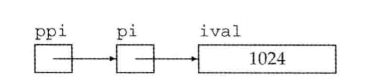

##### 2.3复合类型 基本数据类型+声明符

###### 2.3.1引用：给变量起别名 引用必须初始化

###### 2.3.2指针：

```c++
定义指针类型:声明符*p
int *p1,*p2; //p1和p2都是指向int型对象的指针
//指针存放某个对象的地址，用取地址符 &
int val = 42;
int *p = &val; p是指向变量val的指针，p存放变量val的地址
double dval; //定义double型对象
double *pd = &dval; //double型指针pd指向变量dval
double *pd2= pd;//double型指针pd2
int *pi = pd; //错误，类型不匹配
pi = &dval;错误，将double型对象的指针赋给int型指针
```

- 指针的值（地址）应属于下列四种状态之一：

1、指向一个对象

2、指向紧邻对象所占空间的下一个位置

3、空指针，没有指向任何对象

4、无效指针，上述情况之外的其他指针

- 利用指针访问对象：

```c++
//指针指向一个对象，使用解引用符*来访问该对象
int ival = 42;
int *p = &ival;
cout << *p;//指针p所指的对象，输出42.
*p = 0; //通过此操作可以更改指针指向的对象的值
cout << *p;
```

```c++
int i = 42;//int型变量
int &r = i;//给变量i起别名r
int *p;//定义指针p
p = &i;//p存放i的地址，p是指向i的指针
*p = i;//p指针指向的对象依然是i
int &r2 = *p; //r2是p指向对象i的引用
```

- 赋值和指针：

指针和引用都能提供对其它对象的间接访问

引用在初始化时绑定了对象，无法再访问其他的对象

指针可以重新赋值，让指针重新存放一个新的地址，从而指向一个新的对象

```c++
int i = 42;
int *pi = 0;  //定义空指针
int *pi1 = &i;//指针pi1指向变量i
int *pi3;
pi3 = pi1; //指针pi3和pi1都指向i
pi1 = 0; //pi1不指向任何对象
pi = &ival;//pi指向ival
*pi = 0;//pi指向的对象ival被改变
```

- void *指针

特殊的指针类型，可以存放任意对象的地址

```c++
double obj = 3.14, *pd = &obj;
void *pv = &obj;//obj可以是任意类型的对象
pv = pd;
```

- 指向指针的指针

将指针的地址再存放到另一个指针中

```c++
int ival = 1024;
int *pi = &ival; //pi是指向int型的数
int **ppi = &pi; //ppi指向int型的指针
cout << ival << *pi << **ppi; //都输出42
```



- 指向指针的引用

```c++
int i = 42; 
int *p;
int *&r = p; //r是对指针p的引用 r也是指针
r = &i;//r引用了一个指针，给r赋值&i就是令p指向i
*r = 0;//解引用r得到i，也就是p指向的对象，将i的值改为0
```

##### 2.4、const限定符

const对象创建后其值不能被改变，因此必须初始化

- const的引用

```c++
const int ci = 1024;//常量对象
const int &r1 = ci;//ri是对常量ci的引用
r1 = 42; //r1是对常量的引用不能改变
int &r2 = ci;//不能让非常量引用指向一个常量对象
```

- 指针和const

要想存放指向常量的地址，只能使用指向常量的指针

```c++
const double pi = 3.14; //常量对象
double *ptr = &pi; //错误 
const double *cptr = &pi;//正确
*cptr = 42;//错误，不能给*cptr赋值
```

使用getline读取一整行 

- string

```c++
int main(){
	string line;
	while(getline(cin,line))
		cout << line << endl;
	return 0;
}
```

```c++
string s1 = "world";
string s = s1 + "hello";//正确，一个string和一个字面值相加
string s2 = "hello" + ".";//错，两个运算对象都不是string
```

- vector是一种类模板

```c++
vector<int> v1(10);//v1有10个元素，每个都是0
vector<int> v2{10};//v2有1个元素，该元素的值是10
vector<int> v1(10,1);//v1有10个元素，每个都是1
vector<int> v2{10,1};//v2有2个元素，元素的值是10和1

vector<string> v1{"hi"};//v1有1个元素"hi"
vector<string> v2("hi");//错误
vector<string> v1{10};//v1有10个默认初始化的元素
vector<string> v2{10,"hi"};//v2有10个元素"hi"
```

######  3.5.3、指针和数组

```
string nums[] = {"one","two","three"};
string *p = &nums[0];
string *p2 = nums; //等价于p2 = &nums[0]

int arr[] = {1,2,3,4,5,6,0};
int *p = arr; //p指向数组的第一个元素
++p;//p指向arr[1]
```

#### 6.函数

##### 6.1函数基础

###### 6.1.1局部对象

在C++中，名字有作用域，对象有生命周期。

- 自动对象

对局部变量来说，经过变量定义后创建该对象，在到达定义所在的块的结尾时销毁。把只存在于块执行期间的对象称为自动对象，当块执行结束时，块中创建的自动对象就变成未定义的了。

形参是一种自动对象。

- 局部静态对象

某些时候，需要使局部变量的生命周期贯穿函数调用及之后的时间，这是可以将局部变量定义成static类型从而获得这样的对象。

局部静态对象在程序执行路径第一次经过对象定义语句时初始化，并且到程序中止才被销毁，在此期间即使对象所在的函数执行结束也不会对他有影响。

###### 6.1.2函数声明

函数声明时可以不写形参。

一般在头文件中对函数进行声明，在源文件中定义。能确保同一函数的所有声明保持一致，一旦想要改变函数的接口，只需要改变声明即可。

###### 6.1.3分离式编译

编译和链接多个源文件。

多个文件组成的程序是如何编译予执行的？

##### 6.2参数传递

每次调用函数时，都会重新创建它的形参，并且用传入的实参对形参初始化。如果形参是引用类型，它将绑定到对应的形参上，否则，将实参的值拷贝后赋给形参。

###### 6.2.1传值参数

当实参的值拷贝给形参时，形参和实参是两个相互独立的对象。

指针形参，当执行指针拷贝操作时，拷贝的是指针的值。拷贝之后，两个指针是不同的指针。因此指针使我们可以间接地访问他所指的对象，所以通过指针可以修改他所指的对象的值。

###### 6.2.2传引用参数

当形参是引用类型时，引用形参也是与它绑定的对象的别名，也就是说引用形参是它对应的实参的别名。

使用引用避免拷贝，当函数无需修改引用形参的值，最好使用常量引用。

使用引用形参返回额外信息。函数同时返回多个值。

###### 6.2.3 const形参和实参

尽量使用常量引用

###### 6.2.4数组形参

因为不允许拷贝数组，无法以值传递的方式使用数组参数。因为数组会被转换为指针，多以当我们为函数传递一个数组时，实际上传递的是数组首元素的指针。

```c++
void print(const int*);
void print(const int[]);
void print(const int[10]);//这里表示期望数组有10个元素，实际不一定
//以上三个函数是等价的。
{
    int i = 0， j[2] = {0, 1};
    print(&i);  //&i的类型是int*
    print(j);   //j转换成int*并指向j[0]
}
```

当函数确实要改变元素值的时候，才把形参定义成指向非常量的指针。

###### 6.2.5 main：处理命令行选项

目前为止，定义的main函数都只有空形参列表。

然而，有时候确实需要给main传递实参。P223

###### 6.2.6 含有可变形参的函数

case:无法预知应该向函数传递几个形参。

两种方法：

1、如果实参的类型都相同，可以传递一个initializer_list的标准库类型。

2、如果实参的类型不同，可以编写一种特殊的函数，也就是可变参数模板。

##### 6.3 return

###### 6.3.1

return返回值的类型必须与函数的返回类型相同，或者能隐式的转换。

值是如何被返回的？

返回一个值的方式和初始化一个变量或者形参的方式完全一样。返回的值用于初始化调用点的一个临时量，该临时量就是函数调用的结果。

注意不要返回局部对象的引用或指针：函数完成之后，局部对象所占用的存储空间也随之被释放，因此，函数终止意味着局部变量的引用将指向不再有效的内存区域。

C++11新标准：函数可以返回花括号包围的值的列表。

return {"function", "okay"};

主函数main的返回值：允许main函数没有return直接结束，如果到达main函数的结尾而且没有return 语句，编译器将隐式地插入一条返回0的return语句。

###### 6.3.3返回数组指针

数组不能被拷贝，所以函数不能返回数组。

##### 6.4 函数重载

同一作用域的几个函数名字相同但形参列表不同，称之为重载。

###### 6.4.1 重载与作用域

如果在内层作用域声明名字，它将隐藏外层作用域下声明的同名实体。

##### 6.5特殊用途语言特性

###### 6.5.2 内联inline函数和constexpr函数

内联只是向编译器发起得请求，编译器可以选择忽略。

constexpr函数是指能用于常量表达式的函数。

##### 6.7函数指针

当我们将函数名作为一个值使用时，该函数自动地转换为指针。

#### 7.类  

主要关注数据抽象的重要性。数据抽象能帮助我们将对象的具体实现与对象所能执行的操作分离开来。

类的基本思想是数据抽象和封装。数据抽象是一种依赖于接口和实现分离的编程技术。

类的接口：包括用户所能执行的操作。

类的实现：包括类的数据成员、负责接口实现的函数体以及定义类所需的各种私有函数。

封装实现了类的接口和实现的分离。封装后的类隐藏了具体的实现细节。类的用户只能使用接口而无法访问实现部分。

类想要实现数据抽象和封装，首先需要定义一个抽象数据类型。在抽象数据类型中，由类的设计者负责考虑类的实现过程，使用该类的程序员只需要抽象的思考类做了什么，无需管工作细节。

构造函数不能声明成const

构造函数初始值列表

class和struct都是对于类的定义，两者仅仅是形式上有所不同，实际上可以用这两个关键字中的任意一个定义类，唯一的区别是，两者的默认访问权限不一样。

struct的默认访问权限是public， class的默认访问权限是private.

一般来说，在类定义开始或结束的位置集中声明友元。

封装的优点：

1、确保用户代码不会无意间破坏封装对象的状态

2、被封装的类的具体实现细节可以随时改变，而无需调整用户级别的代码。

使用关键字explicit可以组织构造函数的隐式转换

explicit构造函数只能用于直接初始化，不能用于其他的拷贝构造或其他

聚合类：1、所有成员public 2、没有定义任何构造函数 3、没有类内初始值 4、没有基类，也没有virtual

类的静态成员：有时候类需要它的一些成员与类本身直接相关，而不是与类的各个对象保持关联。在成员的声明之前加上关键字static使得与类关联在一起。

类的静态成员存在于任何对象之外，对象中不包括任何与静态数据成员有关的数据。类似的，静态成员函数也不与任何对象绑定在一起，它们不包括this指针。作为结果，静态成员函数不能声明成const的，而且也不能在static函数体内使用this指针。

虽然静态成员不属于类的对象，但是我们仍然可以使用类的对象、引用或者指针来访问静态成员。

static关键字只出现在类内的生命，类外的定义不需要static关键字

因为静态数据成员不属于类的任何一个对象，所以它们并不是在创建类的对象时被定义的，这意味着它们并不是由类的构造函数初始化的。而且一般来说，我们不能在类的内部初始化静态成员，必须在类的外部定义和初始化每个静态成员，一个静态数据成员只能定义一次。

### Ⅱ C++标准库

#### 8.IO库

C++不直接处理输入输出，而是通过一组定义在标准库中的类型来处理IO。这些类型支持从设备处理数据、向设备写入数据的IO操作，设备可以是文件、控制台窗口等。

##### 8.1 IO类

一些类如string通常也会定义类似的IO操作来读写自己的对象。

- istream 输入流，提供输入操作
- ostream输出流，提供输出操作
- cin 一个istream对象，从标准输入读取数据
- cout一个ostream对象，向标准输出写入数据
- cerr 一个ostream对象，通常能够用于输出程序错误信息，写入到标准错误
- 运算符>>，用于从一个istream对象读取输入数据
- 运算符<<, 用于向一个ostream对象写入输出数据
- getline函数 从一个给定的istream读取一行数据，从入一个给定的string对象中

iostream 用于读写流的基本类型 fstream定义读写命名文件的类型 sstream定义了读写内存string对象的类型。

###### 8.1.1 IO对象无拷贝或赋值

不能拷贝IO对象，因此也不能将形参或返回类型设置为流类型

#### 9.顺序容器

一个容器就是一些特定类型对象的集合。顺序容器为程序员提供了控制元素存储和访问顺序的能力。这种顺序不依赖于元素的值，而是和元素加入容器时的位置相对应。

##### 9.1 顺序容器概述

所有顺序容器都提供了快速顺序访问元素的能力。

vector 可变大小数组，支持快速随机访问，在尾部之外的位置插入或删除元素可能很慢

deque 双端队列，支持快速随机访问，在头尾位置插入/删除速度很快

list 双向链表，只支持双向顺序访问，在list中任何位置插入和删除速度都很快

forward_list 单向链表，只支持单项顺序访问，在链表任何位置插入和删除都很快

array 固定大小数组，支持快速随机访问，不能添加或删除元素

string 与vector相似的容器，但专门用于保存字符。随机访问快，在尾部插入/删除快

新标准引入了三个新成员-emplace_front、emplace、emplace_back，这些操作构造而不是拷贝元素。这些操作分别对应push_front、insert、push_back。

当调用push或insert成员函数时，我们将元素类型的对象传递给他们，这些对象被拷贝到容器中。当我们调用一个emplace成员函数时，则是将参数传递给元素类型的构造函数。emplace成员使用这些参数在容器管理的内存空间中直接构造元素。

##### 9.4 vector对象是如何增长的

为了减少容器空间重新分配次数的策略，当不得不获取新的内存空间时，vector和string的实现通常会分配比新的空间需求更大的内存空间。容器预留这些空间作为备用，可用来保存更多的元素。

capacity操作告诉我们容器再不扩张内存空间的情况下可以容纳多少个元素。

reserve操作允许我们通知容器它应该准备保存多少个元素。reserve并不改变容器中元素的数量，仅仅影响vector预先分配多大的内存空间

size是指容器已经保存元素的数量，capacity是在不分配新的内存空间的前提下可以保存多少元素。

##### 9.5 额外的string操作

可以根据下标指定从哪里开始拷贝

s.substr(pos,n);返回一个string,包含s中从pos开始的n个字符的拷贝。pos默认值为0,n的默认值从pos到结尾。

##### 9.6 容器适配器

三个顺序容器适配器：stack queue priority_queue  

适配器是标准库中的一个通用概念。容器、迭代器和函数都有适配器。本质上，一个适配器是一种机制，能使某种事物的行为看起来像另外一种事物一样。一个容器适配器接受一种已有的容器类型，使其行为看起来像一种不同的类型。例如，stack适配器接受一个顺序容器（除array或forward_list之外），并使其操作起来像一个stack

每个适配器都在其底层顺序容器类型之上建立了一个新的接口。

定义一个适配器：每个适配器都定义两个构造函数：默认构造函数创建一个空对象，接受一个容器的构造函数来拷贝该容器来初始化适配器。

所有适配器都要求容器具有添加和删除元素的能力。因此，适配器不能构造在array之上。类似我们也不能用forward_list来构造适配器，因为所有适配器都要求容器具有添加、删除以及访问尾元素的能力。

栈适配器（stack） 是基于deque实现的。

队列适配器（queue）先进先出。priority_queue允许我们为队列中的元素建立优先级。新加入的元素会排在所有优先级比它低的已有元素之前。

#### 10.泛型算法

标准库容器定义的操作集合非常小。标准库并没有给每个容器添加大量功能，而是提供了一组算法。这些算法大多数独立于任何特定的容器，是通用的（泛型的），可用于不同类型的容器和不同类型的元素。

顺序容器只定义了很少的操作：添加、删除、访问首尾元素、确定容器是否为空。用户需要更多的操作：比如查找特定元素、替换或删除一个特定值、重排元素顺序等。

标准库并没有给每个容器都定义成员函数来实现这些操作，而是定义了一组泛型算法，它们实现了一些经典算法的公共接口。比如排序和搜索，它们可以用于不同类型的元素和多种容器类型。

##### 10.1 概述

大多数算法都定义在头文件algorithm中，标准库还在头文件numeric中定义了一组数值泛型算法。

一般，这些算法不直接操作容器，而是遍历由两个迭代器指定的一个元素范围来进行操作。find(vec.begin(), vec.end(), val);

算法如何工作：使用迭代器访问元素并进行匹配，因此不依赖于容器类型。但是算法依赖于元素类型的操作，允许我们使用自定义的操作（=）来代替默认运算符。

##### 10.2 初识泛型算法

###### 10.2.1只读算法 

只会读取其输入范围的元素，而不会改变元素。比如find count

accumulate 求和函数  equal（比较两个序列是否相等）

10.2.2 写容器的算法

使用这类算法时，必须保证序列原大小 大于等于 要求写入的元素数目

fill(vec.begin(), vec.end(), 0) 把容器的所有元素置0

back_inserter 插入迭代器定义在头文件iterator中。当我们通过此迭代器赋值时，赋值运算符会调用push_back将一个具有给定值的元素添加到容器中。

拷贝算法

###### 10.2.3重排容器元素的算法

sort排序 

消除重复单词：使用unique算法来重排vector，使每个单词只出现一次，unique操作不会删除元素，而是覆盖相邻的重复元素，需要使用erase删除从end_unique到容器的结尾的所有元素。

##### 10.3 定制操作

允许我们提供自己定义的操作来代替默认运算符。

###### 10.3.1 向算法传递参数

谓词：重载过的sort 第三个参数 就是谓词 返回可以转换为bool类型的值的参数

谓词是一个可调用的表达式，其返回结果是一个能用做条件的值。标准库算法使用的：一元谓词（只接受单一参数）二元谓词(有两个参数)

###### 10.3.2 lambda表达式

有时我们的操作需要更多参数，超出了算法对谓词的限制。

目前使用过的两种可调用对象是函数和函数指针，还有两种其他可调用对象：重载了函数调用运算符的类和lambda表达式。

一个lambda表达式代码一个可调用的代码单元，可以理解为一个未命名的内联函数。一个lambda有一个返回类型、一个参数列表和一个函数体。lambda也可能定义在函数内部。

###### 10.3.4 参数绑定


##### 10.4 再探迭代器

10.4.1 插入迭代器 ：这些迭代器被绑定到一个容器上，可以用来向容器插入元素。

10.4.2 流迭代器：这些迭代器被绑定到一个容器上，可用来向容器插入元素。

10.4.3反向迭代器：这些迭代器向后而不是向前移动，除了forward_list都有反向迭代器。

10.4.4 移动迭代器：这些专用的迭代器不是拷贝其中的元素，而是移动它们。

##### 10.5 泛型算法结构

算法所要求的迭代器操作可以分为5个迭代器类别，每个算法都会对他的每个迭代器参数知名提供哪类迭代器。

| 输入迭代器     | 只读，不写，单边扫描，只能递增       |
| -------------- | ------------------------------------ |
| 输出迭代器     | 只写，不读，单边扫描，只能递增       |
| 前向迭代器     | 可读写，多遍扫描，只能递增           |
| 双向迭代器     | 可读写，多遍扫描，可递增递减         |
| 随机访问迭代器 | 可读写，多遍扫描，支持全部迭代器运算 |

##### 10.6 特定容器算法

#### 11.关联容器

关联容器与顺序容器不同：关联容器中的元素是按照关键字来保存和访问的；顺序容器的匀速是按照他们在容器中的位置来顺序保存和访问的。

两个主要的关联容器是map 和 set

map: key-value

set只包含一个关键字，支持高效的关键字查询

标准库提供8个关联容器

| 按关键字有序保存元素 |                  |
| -------------------- | ---------------- |
| map                  | key-value        |
| set                  | key              |
| multimap             | key可以重复的map |
| multiset             | key可以重复的set |

| 无序集合           |                                  |
| ------------------ | -------------------------------- |
| unordered_map      | 用哈希函数组织的map              |
| unordered_set      | 用哈希函数组织的set              |
| unordered_multimap | key可以重复，用哈希函数组织的map |
| unordered_multiset | key可以重复，用哈希函数组织的set |

pair类型 ，一个pair保存两个数据成员，

#### 12.动态内存

全局对象：程序启动时分配，程序结束时销毁 （静态内存）

局部自动对象：进入定义的程序块被创建，离开时销毁   （栈内存）

局部static对象：第一次使用前分配，程序结束销毁 （静态内存）

另外，C++还支持动态分配对象，动态分配对象的生存期与它们在哪里创建是无关的，只有当显式地被释放时，这些对象才会被销毁。

动态对象的正确释放是编程中容易出错的地方。为了更安全地使用动态对象，标准库定义了两个智能指针类型来管理动态分配的对象。当一个对象应该被释放时，指向它的智能指针可以确保自动地释放它。

除了静态内存和栈内存，每个程序还拥有一个内存池。这部分内存空间被称作自由空间或堆，程序用堆来存储动态分配的对象--即在程序运行时分配的对象。动态对象的生存期由程序控制，当动态对象不再使用时，必须显式地销毁它们。

##### 12.1 动态内存与智能指针

动态内存的管理：new和delete 一对运算符

new: 在动态内存中为对象分配空间并返回一个指向该对象的指针。

delete:接受一个动态对象的指针，销毁该对象，并释放与之关联的内存。

可能出现的问题：

1、忘记释放内存，产生内存泄漏

2、在尚有指针引用内存的情况下我们就释放了它，会产生引用非法内存的指针。

解决方法：

新的标准库提供两种智能指针类型来管理动态对象。智能指针的行为类似常规指针，重要的区别是它负责自动释放所指向的对象。

当动态对象不再被使用时，shared_ptr类会自动释放动态对象。

两种智能指针的区别：   管理底层指针的方式

shared_ptr：允许多个指针指向同一对象

unique_ptr：独占所指的对象

weak_ptr伴随类，是一种弱引用，指向shared_ptr所管理的对象。

###### 12.1.1 shared_ptr 类

类似vector，shared_ptr智能指针也是模板。

```
shared_ptr<string> p1; //shared_ptr,可以指向string
shared_ptr<list<int>> p2; //shared_ptr,可以指向int的list
```

默认初始化的智能指针保存一个空指针。

智能指针的使用和普通指针类似。

| 两种智能指针都支持的操作 |                                                |
| ------------------------ | ---------------------------------------------- |
| shared_ptr<T> sp;        | 空智能指针                                     |
| unique_ptr<T> up;        |                                                |
| p                        | 将p用作一个条件判断，若p指向一个对象，则为true |
| *p                       | 解引用p，获得它指向的对象                      |
| p->mem                   | 等价于(*p).mem                                 |
| p.get()                  | 返回p中保存的指针                              |
| swap(p, q)               | 交换                                           |
| p.swap(q)                |                                                |

- make_shared函数

最安全的分配和使用动态内存的方法是调用一个make_shared的标准库函数

此函数在动态内存中分配一个对象并初始化它，返回指向此对象的shared_ptr

```
shared_ptr<int> p3 = make_shared<int>(42);
```

- shared_ptr的拷贝和赋值

当进行拷贝和赋值操作时，每个shared_ptr都会记录有多少个其他shared_ptr指向相同的对象。

```
auto p = make_shared<int> (42); //p指向的对象只有p一个引用者
auto q(p);  //p和q指向相同对象，此对象有两个引用者
```

可以认为每个shared_ptr内部有一个计数器，通常称为引用计数

- shared_ptr 自动销毁所管理的对象

当指向一个对象的最后一个shared_ptr被销毁，shared_ptr会自动销毁此对象，通过析构函数完成销毁。shared_ptr 还会自动释放相关联的内存。

###### 12.1.2 直接管理内存

new delete

###### 12.1.3 shared_ptr和new结合使用

```
shared_ptr<int> p2(new int(42));  //必须使用这样的默认初始化方式
```

不要混合使用普通指针和智能指针

也不要使用get初始化另一个智能指针或者为智能指针赋值

###### 12.1.4 智能指针和异常

跳

